# 🌌 Welcome to my universe!

---

## 💻 About Me

- 🎯 **Current Focus:** Crafting applications with **React** and **NodeJS**
- 📚 **Learning Next:** Mastering Cloud Solutions **(AWS/GCP)** and **DevOps**
- 🌏 **Location:** Vietnam 🇻🇳
- ⚡ **Fun fact:** I debug with coffee ☕ and ship with passion 🚀

---

## 📧 Connect with Me

---

## 🚀 My Tech

---

## 🔧 My Stack & Tools

---

## 📊 GitHub Activity Graph

---

## 📈 GitHub Analytics & Streak

---

## 🐍 Fun Fact: Commit Snake

<picture>
  <source media="(prefers-color-scheme: dark)" srcset="https://raw.githubusercontent.com/quocvo114/quocvo114/output/github-contribution-grid-snake-dark.svg" />
  <source media="(prefers-color-scheme: light)" srcset="https://raw.githubusercontent.com/quocvo114/quocvo114/output/github-contribution-grid-snake.svg" />
  
</picture>

---

*"Code is poetry, and every commit tells a story."* ✨

